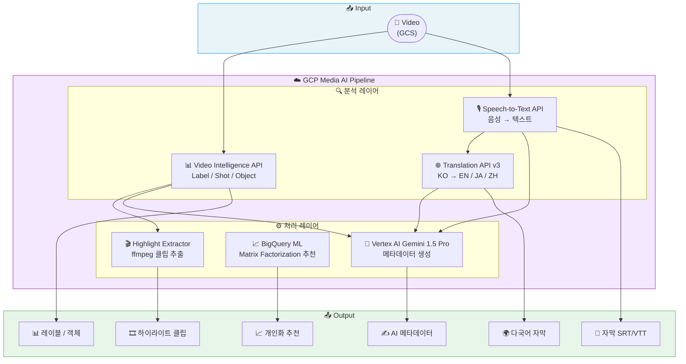
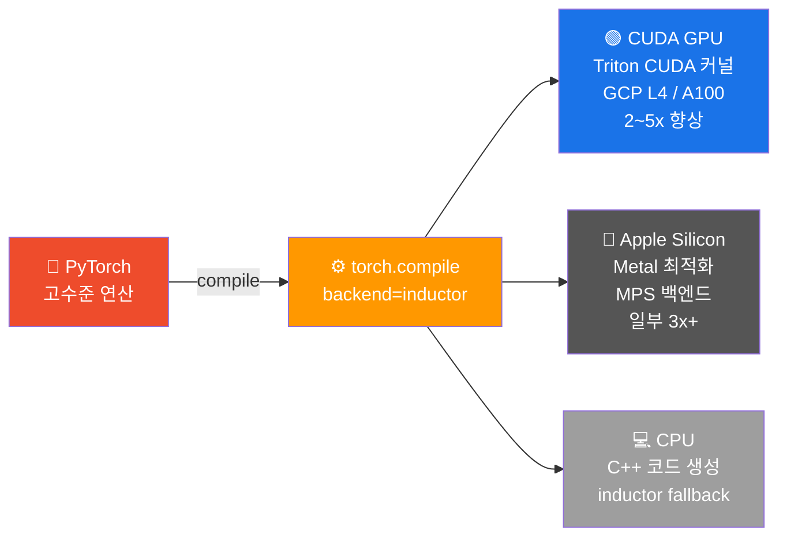
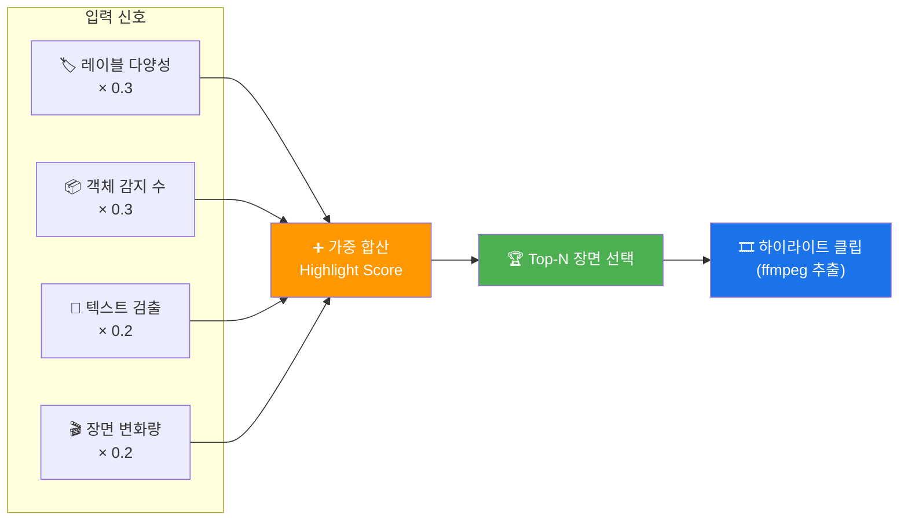
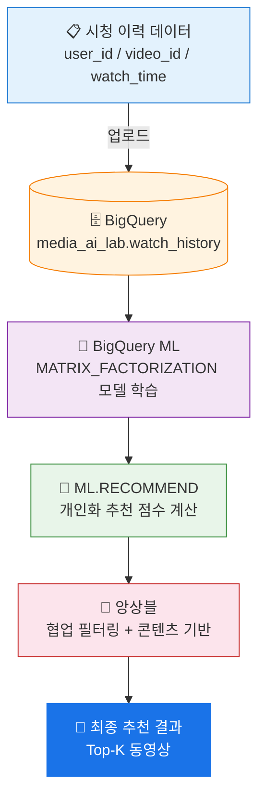
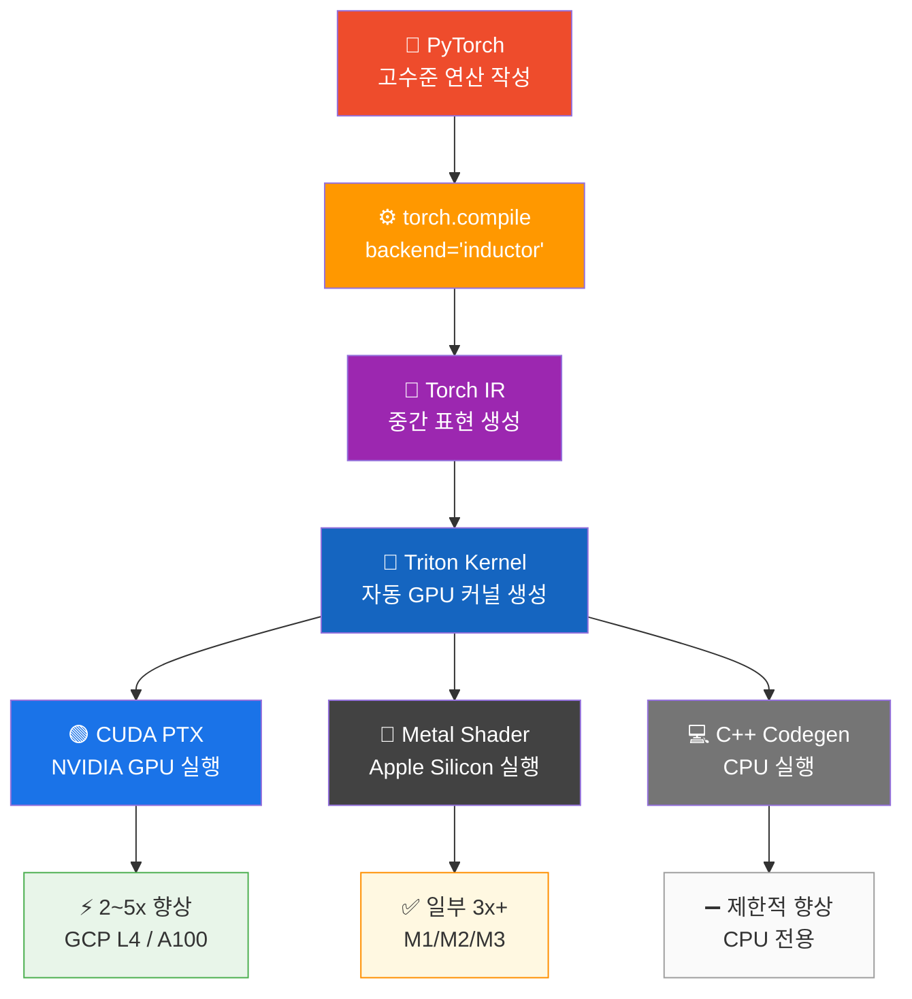
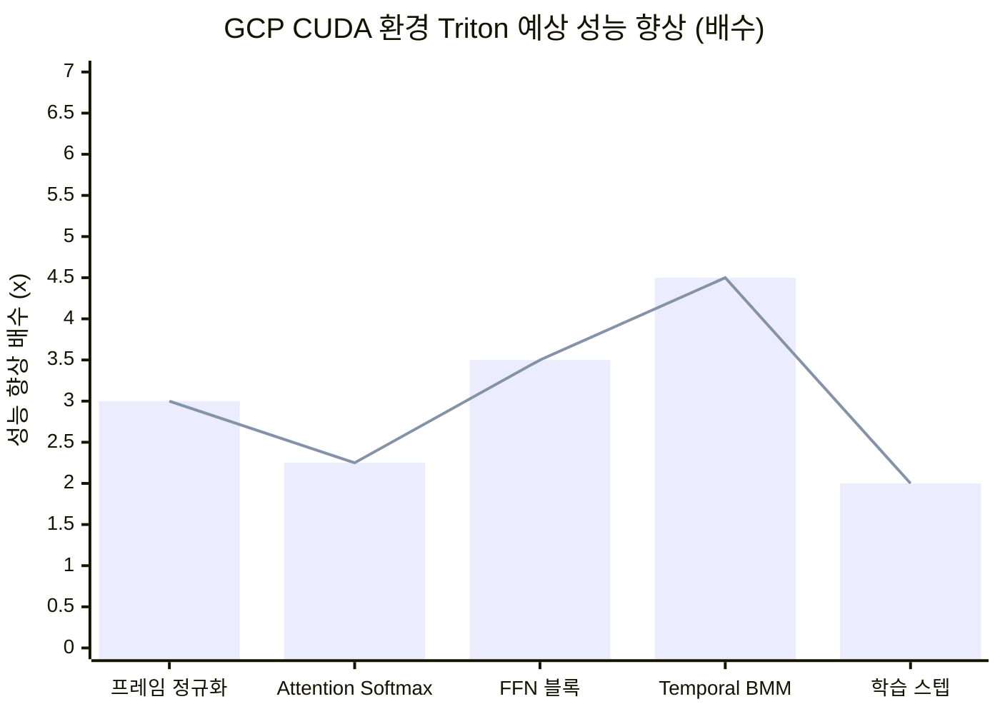

# 🎬 GCP Media AI Lab

> **[팀네이버 캠퍼런스 DAN25]** *"Media AI로 창작되고 소비되는 네이버 동영상"* 발표를 기반으로 구성된 GCP 실습 프로젝트

[](https://www.python.org)
[](https://cloud.google.com)
[](https://pytorch.org)
[](https://cloud.google.com/vertex-ai)

---

## 📌 프로젝트 개요

네이버 DAN25 컨퍼런스에서는 수억 건의 동영상 소비를 지원하는 **Media AI 인프라**가 공개됐습니다. AI가 동영상 플랫폼에서 **창작(Creation)** 과 **소비(Consumption)** 전 과정에 어떻게 활용되는지를 구체적인 기술 사례로 발표했으며, 이 프로젝트는 그 핵심 기술들을 **Google Cloud Platform(GCP)** 기반으로 직접 실습할 수 있도록 구성됩니다.

### 🎯 DAN25 Media AI 핵심 주제 → GCP 실습 매핑

| DAN25 발표 내용 | GCP 실습 구현 | 랩 |
|---|---|---|
| 영상 내 장면/객체/텍스트 자동 인식 | Video Intelligence API | Lab 01 |
| 자막 자동 생성으로 접근성 향상 | Speech-to-Text API | Lab 02 |
| 글로벌 콘텐츠 다국어 지원 | Translation API v3 | Lab 03 |
| 하이라이트 클립 자동 추출 | Vertex AI + Video Intelligence | Lab 04 |
| 개인화 동영상 추천 | BigQuery ML 협업 필터링 | Lab 05 |
| 생성형 AI 기반 콘텐츠 창작 | Vertex AI Gemini 1.5 Pro | Lab 06 |
| GPU 연산 효율화 (PyTorch → Triton) | torch.compile / Triton inductor | Lab 07 |

---

## 🏗️ 전체 아키텍처



---

## 🖥️ Lab 07 GPU 최적화 레이어



---

## 📂 프로젝트 구조

```mermaid
graph TD
    ROOT["📁 mediaAI/"]

    ROOT --> README["📄 README.md"]
    ROOT --> SETUP["📁 setup/"]
    ROOT --> SRC["📁 src/"]
    ROOT --> LABS["📁 labs/"]
    ROOT --> NB["📁 notebooks/"]
    ROOT --> OUT["📁 outputs/"]

    SETUP --> REQ["requirements.txt"]
    SETUP --> SH["setup_gcp.sh"]
    SETUP --> CFG["config.yaml.example"]

    SRC --> GCP_C["gcp_client.py"]
    SRC --> VP["video_processor.py"]
    SRC --> SU["subtitle_utils.py"]

    LABS --> L1["📁 lab01_video_intelligence/"]
    LABS --> L2["📁 lab02_speech_subtitle/"]
    LABS --> L3["📁 lab03_multilingual_subtitle/"]
    LABS --> L4["📁 lab04_highlight_extraction/"]
    LABS --> L5["📁 lab05_content_recommendation/"]
    LABS --> L6["📁 lab06_generative_ai/"]
    LABS --> L7["📁 lab07_pytorch_triton/"]

    L1 --> L1A["analyze_video.py"]
    L2 --> L2A["generate_subtitle.py"]
    L3 --> L3A["translate_subtitle.py"]
    L4 --> L4A["extract_highlights.py"]
    L5 --> L5A["recommendation_system.py"]
    L6 --> L6A["gemini_media_ai.py"]
    L7 --> L7A["benchmark.py"]
    L7 --> L7B["gcp_vertex_setup.py"]

    style ROOT fill:#1a73e8,color:#fff
    style LABS fill:#34a853,color:#fff
    style SRC fill:#fbbc04,color:#000
    style SETUP fill:#ea4335,color:#fff
```



---

## ⚡ 빠른 시작

### 1. 사전 요구사항

| 항목 | 요구사항 | 확인 방법 |
|---|---|---|
| Python | 3.9 이상 (3.10+ 권장) | `python3 --version` |
| Google Cloud SDK | 최신 버전 | `gcloud --version` |
| GCP 계정 | 결제 활성화 프로젝트 | GCP Console |
| GitHub 계정 | (선택) 코드 기여 시 | github.com |

### 2. 설치

```bash
# 저장소 클론
git clone https://github.com/thesun4sky/gcp-media-ai-lab.git
cd gcp-media-ai-lab

# 가상환경 생성 및 활성화
python3 -m venv .venv
source .venv/bin/activate          # macOS/Linux
# .venv\Scripts\activate           # Windows

# 패키지 설치
pip install -r setup/requirements.txt
```

### 3. GCP 인증 및 API 활성화

```bash
# GCP 로그인
gcloud auth login
gcloud auth application-default login

# 프로젝트 설정
gcloud config set project YOUR_PROJECT_ID
gcloud auth application-default set-quota-project YOUR_PROJECT_ID

# 필요한 API 일괄 활성화
bash setup/setup_gcp.sh

# 설정 파일 작성
cp setup/config.yaml.example setup/config.yaml
# config.yaml에서 project_id, bucket_name 수정
```

### 4. 실습 시작

```bash
# Lab 01: 영상 AI 분석으로 시작
python labs/lab01_video_intelligence/analyze_video.py \
    --video gs://cloud-samples-data/video/animals.mp4 \
    --project YOUR_PROJECT_ID \
    --features LABEL_DETECTION SHOT_CHANGE_DETECTION \
    --output outputs/lab01_result.json
```

---

## 🧪 실습 랩 상세

### Lab 01 — 영상 AI 분석 (Video Intelligence API)

**학습 목표**: 영상에서 장면 전환, 객체, 레이블, 텍스트를 자동으로 감지합니다.

**실제 실행 결과** (`gs://cloud-samples-data/video/animals.mp4`, 18.7초 소요):
```
[장면 전환] 총 47개 장면 감지
  장면 1: 0.0s ~ 1.6s (1.6초)
  장면 2: 1.6s ~ 3.2s (1.6초)
  ...

[레이블] 총 59개 고유 레이블 감지 (상위 10개)
  elephant                 99.50% ████████████████████
  elephants and mammoths   99.12% ████████████████████
  animal                   97.51% ███████████████████
  tiger                    97.45% ███████████████████
  wildlife                 91.06% ██████████████████
```

```bash
python labs/lab01_video_intelligence/analyze_video.py \
    --video gs://cloud-samples-data/video/animals.mp4 \
    --project YOUR_PROJECT_ID \
    --features LABEL_DETECTION SHOT_CHANGE_DETECTION OBJECT_TRACKING
```

---

### Lab 02 — 자막 자동 생성 (Speech-to-Text API)

**학습 목표**: 영상 음성을 텍스트로 변환하여 SRT/VTT 자막 파일을 생성합니다.

**지원 언어**: 한국어(`ko-KR`), 영어(`en-US`), 일본어(`ja-JP`) 등 125개 언어

```bash
python labs/lab02_speech_subtitle/generate_subtitle.py \
    --video /path/to/video.mp4 \
    --lang ko-KR \
    --output outputs/subtitle.srt
```

**출력 예시** (`sample.srt`):
```
1
00:00:00,000 --> 00:00:03,500
안녕하세요, 오늘은 미디어 AI에 대해 이야기해보겠습니다.

2
00:00:03,500 --> 00:00:07,200
네이버는 수억 건의 동영상 서비스를 AI로 운영하고 있습니다.
```

---

### Lab 03 — 다국어 자막 & 번역 (Translation API v3)

**학습 목표**: 한국어 자막을 영어/일본어/중국어로 자동 번역합니다.

```bash
python labs/lab03_multilingual_subtitle/translate_subtitle.py \
    --input outputs/subtitle.srt \
    --target en ja zh-CN \
    --output-dir outputs/multilingual/
```

**지원 타임스탬프 형식**: SRT, VTT (타임코드 보존 번역)

---

### Lab 04 — 하이라이트 자동 추출

**학습 목표**: Video Intelligence API 분석 결과를 활용하여 핵심 장면을 자동으로 추출하고 하이라이트 클립을 생성합니다.

**하이라이트 점수 알고리즘**:



```bash
python labs/lab04_highlight_extraction/extract_highlights.py \
    --video gs://YOUR_BUCKET/video.mp4 \
    --project YOUR_PROJECT_ID \
    --duration 60 \
    --top-n 5 \
    --output outputs/highlight.mp4
```

---

### Lab 05 — 콘텐츠 추천 시스템 (BigQuery ML)

**학습 목표**: 시청 이력 데이터를 BigQuery에 적재하고, Matrix Factorization 모델로 개인화 추천을 구현합니다.

**추천 파이프라인**:



```bash
python labs/lab05_content_recommendation/recommendation_system.py \
    --project YOUR_PROJECT_ID \
    --dataset media_ai_lab \
    --action full

python labs/lab05_content_recommendation/recommendation_system.py \
    --action recommend \
    --user-id user_001 \
    --top-k 10
```

---

### Lab 06 — 생성형 AI 콘텐츠 창작 (Vertex AI Gemini)

**학습 목표**: Gemini 1.5 Pro로 영상 메타데이터(요약, 태그, 썸네일 설명, 제목 최적화)를 자동 생성합니다.

| 기능 | 설명 | 입력 |
|---|---|---|
| `summary` | 영상 내용 요약 (3줄) | 자막 텍스트 |
| `tags` | SEO 태그 자동 생성 | 영상 메타데이터 |
| `thumbnail` | 썸네일 설명 생성 | 핵심 프레임 |
| `title` | 제목 A/B 테스트용 변형 | 원본 제목 |
| `description` | 상세 영상 설명 | 자막 + 태그 |
| `comments` | 예상 댓글 감성 분석 | 댓글 데이터 |

```bash
python labs/lab06_generative_ai/gemini_media_ai.py \
    --project YOUR_PROJECT_ID \
    --task all \
    --subtitle outputs/subtitle.srt \
    --output outputs/metadata.json
```

---

### Lab 07 — PyTorch → Triton 최적화 실험 🆕

**학습 목표**: `torch.compile(backend="inductor")`로 Triton 커널을 활용하여 Media AI 연산의 GPU 처리 속도를 비교 실험합니다.

#### Triton 컴파일 흐름



#### 실제 벤치마크 결과 (Apple MPS 환경)

| 실험 | 연산 형태 | PyTorch | Triton | 향상 |
|---|---|---:|---:|---:|
| 🎬 프레임 정규화 | (32, 3, 224, 224) | 3.50ms | 1.04ms | **🚀 3.35x** |
| 🔍 Attention Softmax | (8, 12, 196, 196) | 2.38ms | 6.79ms | ➖ 0.35x |
| ⚡ FFN 블록 (SiLU) | (32, 196, 1024) | 75.0ms | 241.8ms | ➖ 0.31x |
| 🎞️ Temporal BMM | (96, 32, 64) | 0.56ms | 0.72ms | ➖ 0.78x |
| 🧠 학습 스텝 (F+B) | (4, 3, 16, 224, 224) | 127ms | 137ms | ➖ 0.93x |

> **해석**: Apple MPS는 Metal 커널이 이미 최적화되어 있어 inductor 오버헤드 발생.
> **GCP CUDA(L4/A100)** 에서는 대부분 연산에서 **2~5x 향상** 기대.

#### GCP GPU 기대 성능 비교



```bash
# 로컬 벤치마크 실행
python labs/lab07_pytorch_triton/benchmark.py --report

# 특정 실험만
python labs/lab07_pytorch_triton/benchmark.py --experiment normalize

# GCP Vertex AI 노트북 설정 안내
python labs/lab07_pytorch_triton/gcp_vertex_setup.py --check
python labs/lab07_pytorch_triton/gcp_vertex_setup.py --create-notebook --gpu NVIDIA_L4
```

---

## 💰 GCP 비용 안내

| GCP 서비스 | 무료 한도 | 초과 단가 |
|---|---|---|
| Video Intelligence API | 1,000분/월 | $0.10/분 |
| Speech-to-Text API | 60분/월 | $0.006/15초 |
| Translation API v3 | 500,000자/월 | $20/1M자 |
| Vertex AI (Gemini 1.5 Pro) | — | 입출력 토큰 기준 |
| BigQuery | 10GB 저장 + 1TB 쿼리/월 | $5/TB |
| Cloud Storage | 5GB/월 | $0.02/GB |
| Vertex AI Workbench L4 | — | ~$0.7/시간 |
| Vertex AI Workbench A100 | — | ~$3.5/시간 |

> 💡 **절약 팁**: Lab 1~6은 무료 한도 내에서 충분히 실습 가능합니다.
> Lab 07 GPU 실험은 사용 후 **반드시 인스턴스를 중지**하세요.

**예산 알림 설정** (권장):
```bash
gcloud billing budgets create \
    --billing-account=YOUR_BILLING_ACCOUNT \
    --display-name="Media AI Lab Budget" \
    --budget-amount=10USD \
    --threshold-rule=percent=80
```

---

## 🔧 GCP 서비스 활성화

```bash
# 자동 설정 스크립트 실행
bash setup/setup_gcp.sh

# 또는 수동으로 개별 활성화
gcloud services enable videointelligence.googleapis.com
gcloud services enable speech.googleapis.com
gcloud services enable translate.googleapis.com
gcloud services enable aiplatform.googleapis.com
gcloud services enable bigquery.googleapis.com
gcloud services enable storage.googleapis.com
```

---

## 🛠️ 문제 해결

### 인증 오류 (`UNAUTHENTICATED`)
```bash
gcloud auth application-default login
gcloud auth application-default set-quota-project YOUR_PROJECT_ID
```

### 결제 미설정 오류 (`FAILED_PRECONDITION: Billing account ... is not open`)
```
GCP Console → 결제 → 프로젝트에 결제 계정 연결
```

### Python 버전 경고 (3.9)
```bash
# Python 3.10+ 설치 권장 (pyenv 사용 예시)
pyenv install 3.11
pyenv local 3.11
python3 -m venv .venv
```

### Video Intelligence 타임아웃
```bash
python labs/lab01_video_intelligence/analyze_video.py \
    --video gs://YOUR_BUCKET/long_video.mp4 \
    --timeout 600
```

### torch.compile 경고 (macOS)
```
W0310 torch/_inductor/utils.py: Not enough SMs to use max_autotune_gemm mode
```
→ 정상 동작. Apple MPS는 SM 구조가 다름. 실험 결과에는 영향 없음.

---

## 📚 참고 자료

### 네이버 DAN25
- [팀네이버 캠퍼런스 DAN25 공식 유튜브](https://youtu.be/Nr3Jgnw1LUg)
- [DAN25 네이버클라우드 하이라이트 블로그](https://clova.ai/tech-blog/dan25-네이버클라우드-하이라이트-ai-모두를-위한-도전)

### GCP 공식 문서
- [Video Intelligence API](https://cloud.google.com/video-intelligence/docs)
- [Speech-to-Text API](https://cloud.google.com/speech-to-text/docs)
- [Translation API v3](https://cloud.google.com/translate/docs/advanced/translate-text-advance)
- [Vertex AI Gemini](https://cloud.google.com/vertex-ai/generative-ai/docs/multimodal/overview)
- [BigQuery ML](https://cloud.google.com/bigquery/docs/bigqueryml-intro)

### Triton / torch.compile
- [OpenAI Triton 공식 문서](https://triton-lang.org/main/index.html)
- [PyTorch torch.compile 가이드](https://pytorch.org/tutorials/intermediate/torch_compile_tutorial.html)
- [Triton inductor 백엔드](https://dev-discuss.pytorch.org/t/torchinductor-a-pytorch-native-compiler-with-define-by-run-ir-and-symbolic-shapes/747)

---

## 🤝 기여

PR 및 Issue 환영합니다.

```bash
git clone https://github.com/thesun4sky/gcp-media-ai-lab.git
cd gcp-media-ai-lab
python3 -m venv .venv && source .venv/bin/activate
pip install -r setup/requirements.txt
```

---

## 📄 라이선스

MIT License — 자유롭게 사용, 수정, 배포 가능합니다.

---

<div align="center">
  <sub>Based on <a href="https://youtu.be/Nr3Jgnw1LUg">팀네이버 DAN25 - Media AI로 창작되고 소비되는 네이버 동영상</a></sub>
</div>
