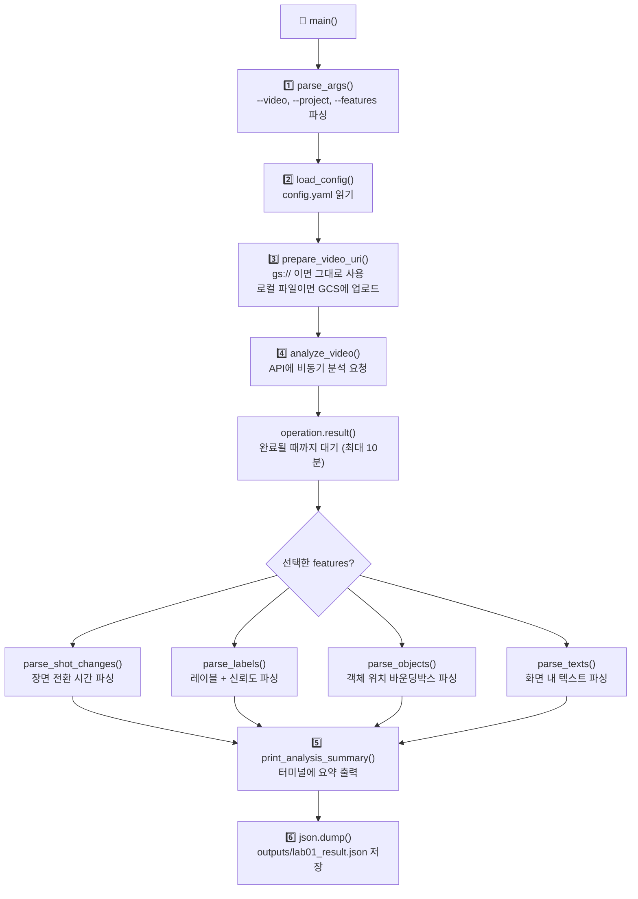

# Lab 01 — 영상 AI 분석 가이드

## 영상 파일 위치 확인

실습에 사용하는 `gs://cloud-samples-data/video/animals.mp4`는 **Google이 공개한 샘플 버킷**입니다. 별도 권한 없이 누구나 읽을 수 있습니다.

```bash
# 버킷 내 video 폴더 목록 전체 보기
gcloud storage ls gs://cloud-samples-data/video/

# 특정 파일 크기 및 날짜 확인
gcloud storage ls -l gs://cloud-samples-data/video/animals.mp4
```

---

## 실행 방법

> 💡 백슬래시(`\`) 줄 연결은 복사/붙여넣기 시 깨질 수 있습니다. **한 줄로 실행**하세요.

```bash
# venv 활성화
source .venv/bin/activate

# 한 줄 실행
python labs/lab01_video_intelligence/analyze_video.py --video gs://cloud-samples-data/video/animals.mp4 --project gen-lang-client-0318067486 --features LABEL_DETECTION SHOT_CHANGE_DETECTION --output outputs/lab01_result.json
```

---

## 코드 흐름



---

## 핵심 코드 설명

### 1. 입력 처리 — 로컬 파일이면 자동 업로드

```python
# prepare_video_uri()
if video_path.startswith("gs://"):
    return video_path          # GCS URI면 그대로 사용
else:
    upload_file_to_gcs(...)    # 로컬 파일이면 버킷에 업로드 후 URI 반환
```

로컬에 있는 영상도 `--video /path/to/video.mp4`처럼 넣으면 자동으로 GCS에 올린 뒤 분석합니다. 단, `--bucket` 옵션으로 버킷 이름을 지정해야 합니다.

---

### 2. API 호출 — 비동기 방식

```python
# analyze_video()
operation = client.annotate_video(
    request={"input_uri": video_uri, "features": api_features}
)
result = operation.result(timeout=600)  # 최대 10분 대기
```

영상을 내 컴퓨터가 직접 분석하는 게 아니라, **GCP 서버에 작업을 맡기고 결과를 기다리는 구조**입니다.
로컬 GPU 없이도 동작하는 이유가 여기에 있습니다.

---

### 3. 4가지 감지 기능

| Feature | 감지 대상 | 결과 예시 |
|---|---|---|
| `SHOT_CHANGE_DETECTION` | 장면 전환 순간 | `0.0s~1.6s`, `1.6s~3.2s` … |
| `LABEL_DETECTION` | 영상에 등장하는 개념 | `elephant 99.5%`, `tiger 97.4%` |
| `OBJECT_TRACKING` | 객체의 화면 내 위치 | 바운딩박스 `left/top/right/bottom` |
| `TEXT_DETECTION` | 화면에 보이는 글자 | 텍스트 문자열 + 좌표 |

각 기능은 독립적으로 선택할 수 있습니다.

```bash
# 장면 전환만 감지
python analyze_video.py --video gs://... --features SHOT_CHANGE_DETECTION

# 레이블 + 객체 추적만 감지
python analyze_video.py --video gs://... --features LABEL_DETECTION OBJECT_TRACKING
```

---

### 4. 레이블 파싱 — 두 가지 레벨

```python
# parse_labels()

# 영상 전체 단위 레이블 (segment_label_annotations)
for label in annotation_result.segment_label_annotations:
    ...

# 장면(shot) 단위 레이블 (shot_label_annotations)
for label in annotation_result.shot_label_annotations:
    ...

# 신뢰도 내림차순 정렬
labels.sort(key=lambda x: x["confidence"], reverse=True)
```

같은 레이블이라도 **영상 전체 수준**과 **장면 수준**으로 나뉘어 감지됩니다.

---

### 5. 결과 저장

```python
# main()
json.dump(analysis_data, f, ensure_ascii=False, indent=2)
# → outputs/lab01_result.json
```

저장된 JSON 구조:

```json
{
  "video_uri": "gs://...",
  "elapsed_seconds": 18.7,
  "shot_changes": [
    { "shot_index": 0, "start_time": 0.0, "end_time": 1.585, "duration": 1.585 }
  ],
  "labels": [
    { "description": "elephant", "confidence": 0.995, "type": "segment_level" }
  ]
}
```

---

## 실제 실행 결과

`gs://cloud-samples-data/video/animals.mp4` 기준 (소요 시간: 18.7초):

```
[장면 전환] 총 47개 장면 감지
  장면 1: 0.0s ~ 1.6s (1.6초)
  장면 2: 1.6s ~ 3.2s (1.6초)
  장면 3: 3.3s ~ 5.3s (2.0초)

[레이블] 총 59개 고유 레이블 (상위 5개)
  elephant                 99.50% ████████████████████
  elephants and mammoths   99.12% ████████████████████
  animal                   97.51% ███████████████████
  tiger                    97.45% ███████████████████
  wildlife                 91.06% ██████████████████
```

---

## 다음 단계

Lab 01이 완료되면 **Lab 02**로 이동합니다.
Lab 02에서는 이 영상의 음성을 텍스트로 변환하여 자막 파일(SRT/VTT)을 자동 생성합니다.

```bash
python labs/lab02_speech_subtitle/generate_subtitle.py --help
```
